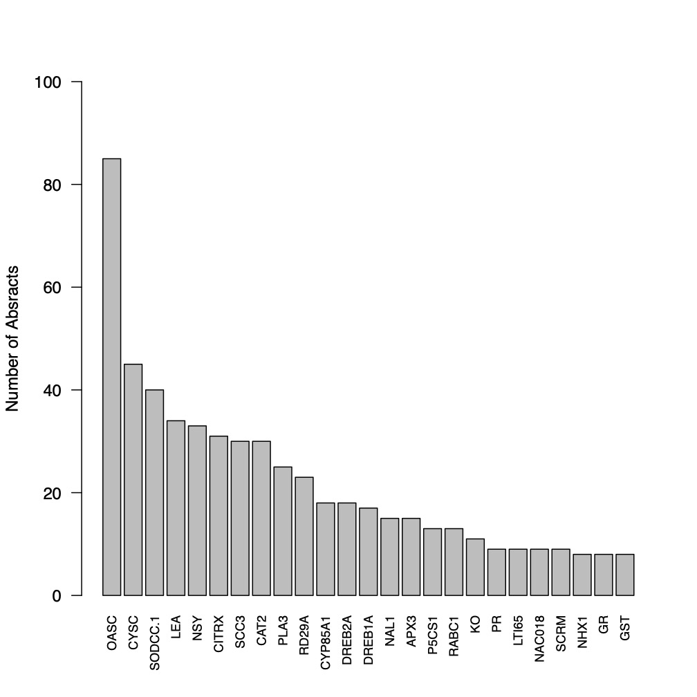
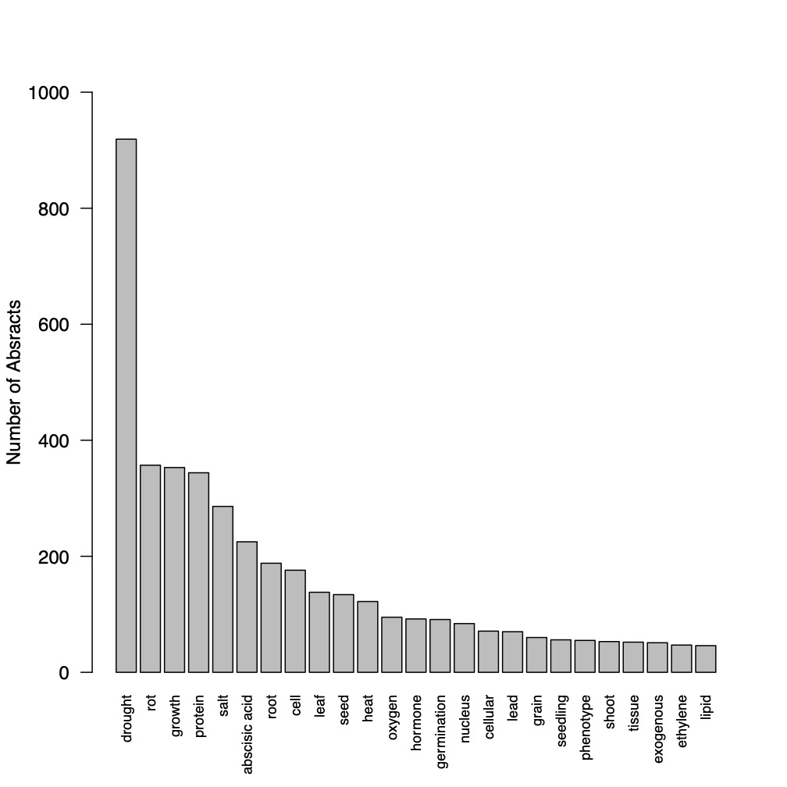
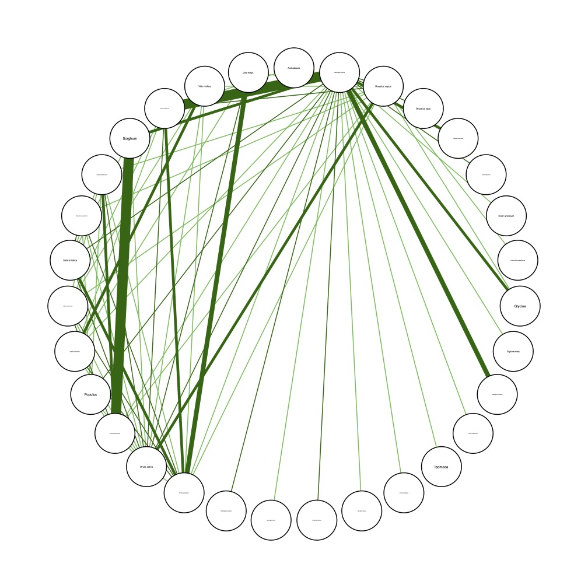
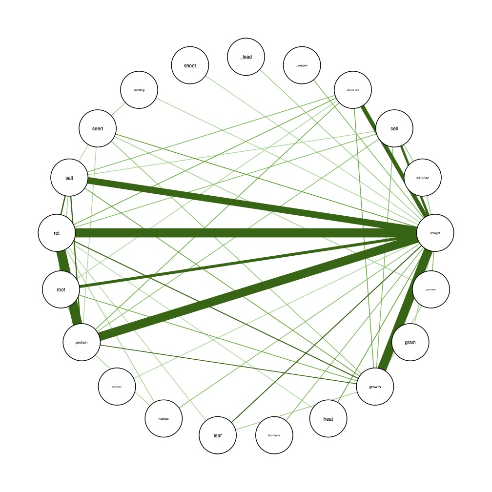
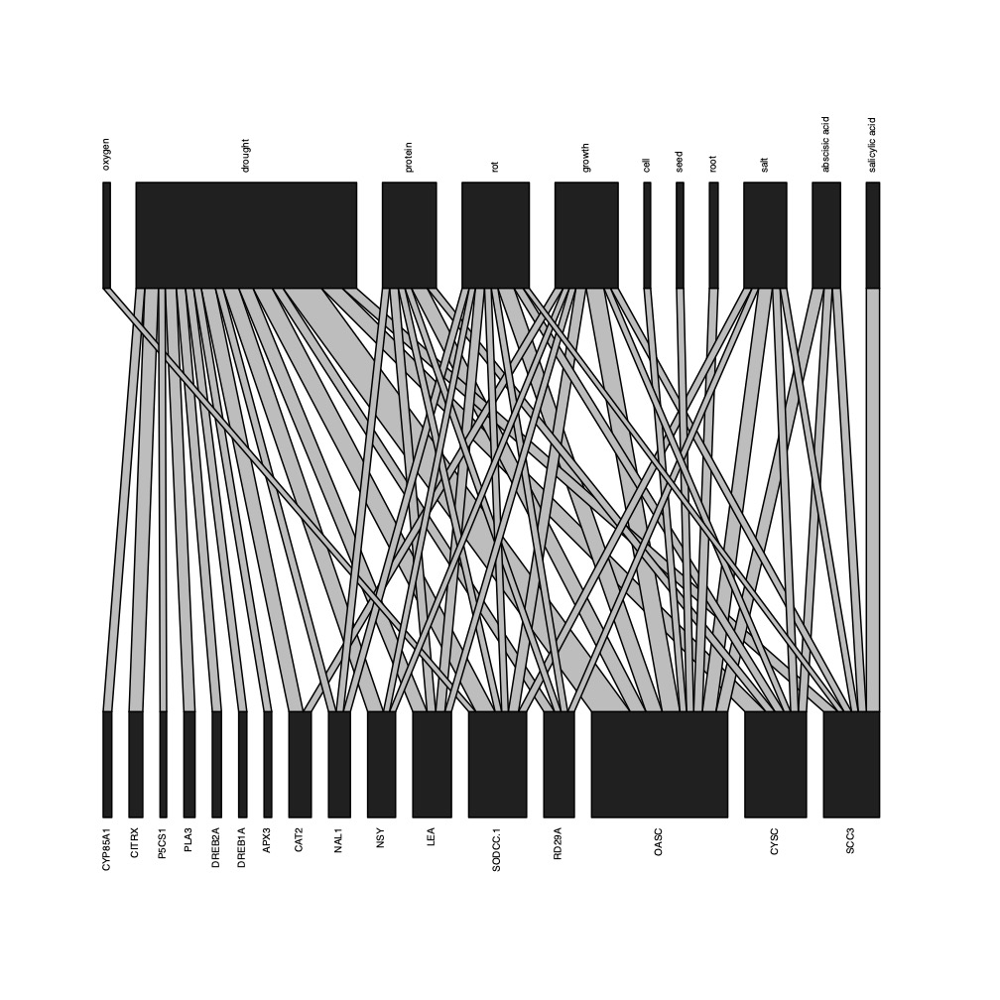
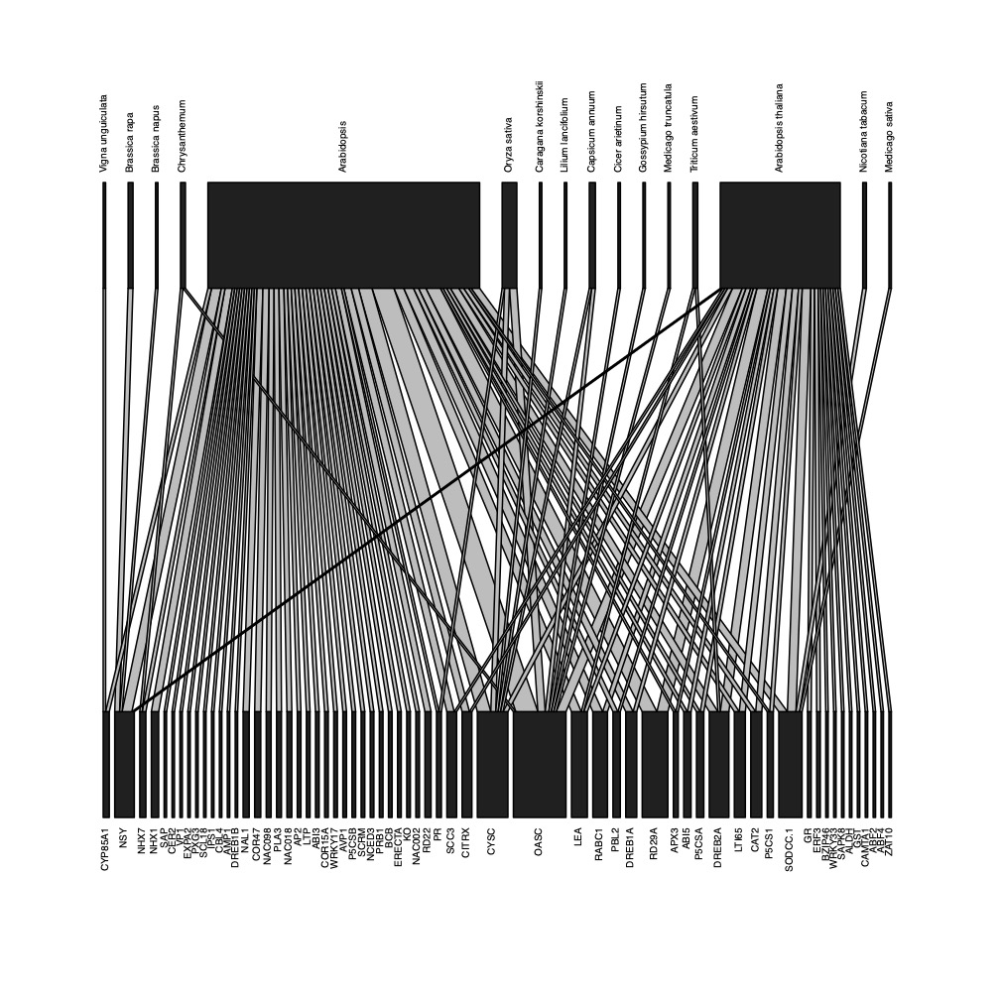
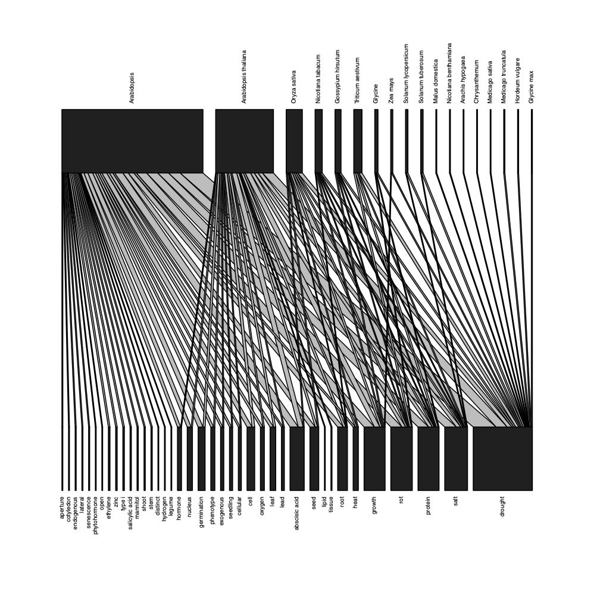
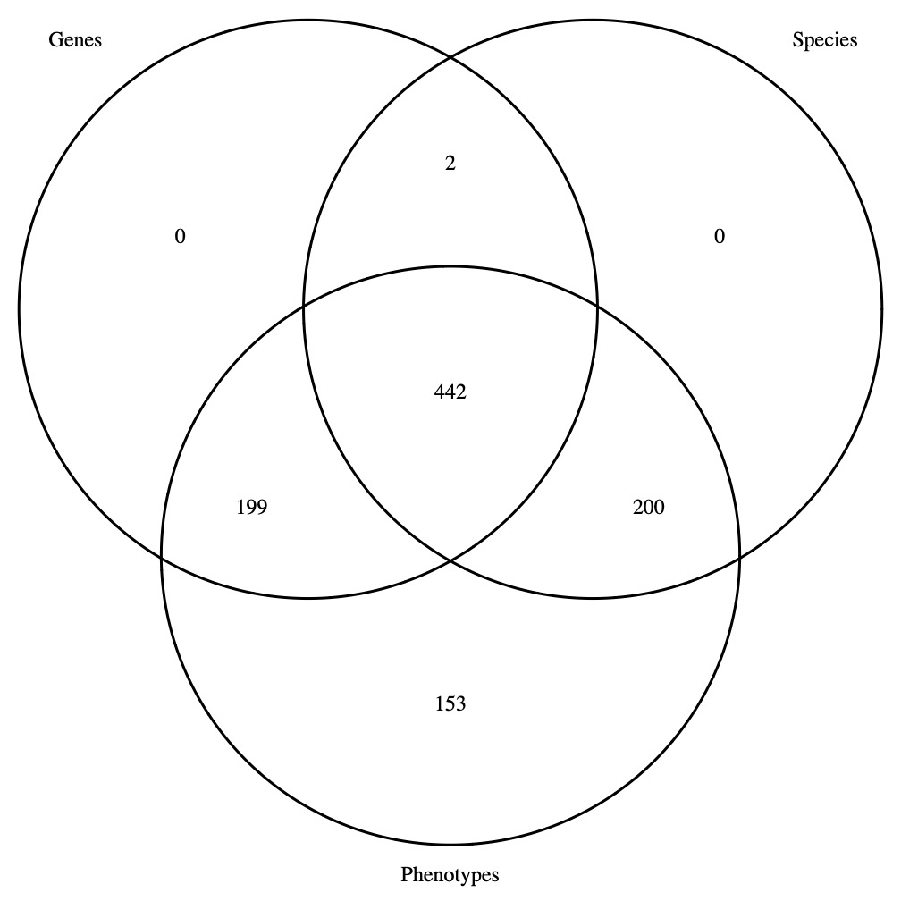

```{js logo-js, echo=FALSE}
$(document).ready(function() {
  $('#header').parent().prepend('<div id=\"logo\"></div>');
  $('#header').css('margin-right', '120px')
});
```

# Start here

These are the figures that are produced by the G2PMineR vignette analysis.

They are examples of figures that you can use in your own literature review.

# Taxonomy (Ta) bar plot

<center>
[]()
</center>

# Genes (G) bar plot

<center>
[]()
</center>

# Phenotype words (P) bar plot

<center>
[]()
</center>

# Taxonomy (Ta) internal network

<center>
[]()
</center>

# Genes (G) internal network

<center>
[]()
</center>

# Phenotype words (P) internal network

<center>
[]()
</center>

# G2P bipartite graph

<center>
[]()
</center>

# Ta2G bipartite graph

<center>
[]()
</center>

# Ta2P

<center>
[]()
</center>

# Consensus Venn Diagram

<center>
[]()
</center>

