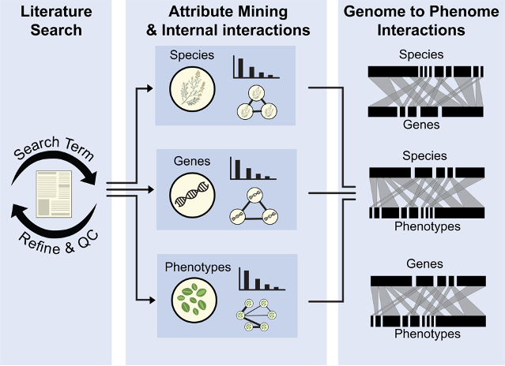

```{js logo-js, echo=FALSE}
$(document).ready(function() {
  $('#header').parent().prepend('<div id=\"logo\"></div>');
  $('#header').css('margin-right', '120px')
});
```

```{r packages, echo=FALSE, warning=FALSE, include=FALSE}
library(knitr)
library(rmarkdown)
library(bookdown)
#library(distill)
library(knitcitations)
library(formatR)
library(devtools)
library(kfigr)
library(dplyr)
library(kableExtra)
library(tufte)

#Generate BibTex citation file for all R packages used to produce report
knitr::write_bib(.packages(), file = 'packages.bib')
```

# Why use G2PMineR?

There is a gap in the conceptual framework linking genes to phenotypes (G2P) for non-model or-ganisms, as most non-model organisms do not yet have genomic resources readily available. To address this, researchers often perform literature reviews to understand G2P linkages by curating a list of likely gene candidates, hinging upon other studies already conducted in closely related systems. Sifting through hundreds to thousands of articles is a cumbersome task that slows down the scientific process and may introduce bias into a study.  To fill this gap, we created G2PMineR, a free and open-source literature mining tool developed specifically for G2P research. This package uses automation to make the G2P review process efficient and unbiased, while also generating hypothesized associations between genes and phenotypes within a taxonomical framework. We applied the package to a literature review for drought-tolerance in plants. The analysis provides biologically meaningful the results within the known framework of drought tolerance in plants. Overall, the package is useful for conducting literature reviews for ge-nome-to-phenome projects and also has broad appeal to scientists investigating a wide range of study systems as it can conduct analyses under the auspices of three different kingdoms (Plantae, Animalia, and Fungi).

# Overview

## Steps of a G2PMineR analysis

The G2PMineR package is composed of 3 steps and eight modules. Step 1 and step 2 module 5 are optional:

*Step 1:* Literature search 

- Module 1: Conduct literature search and assess its efficiency.

*Step 2:* Mining (incl. quality controls) G2P data in abstracts using reference libraries.

- Module 2: Mining taxonomy (Ta).
- Module 3: Mining genes (G).
- Module 4: Mining phenotypes (P).
- Module 5: Summarize and consensus G, Ta and P data.
- Module 6: Internal network analyses for G, Ta and P data.

*Step 3:* Genome to phenome interactions (rooted into taxonomical framework) 

- Module 7: Infer bipartite graphs to link G, Ta and P data.

## G2PMineR Flowchart

[]


# Installing G2PMineR

## Dependencies

devtools

You can find G2PMineR on GitHub at wojahn/G2PMineR.

```{r, eval = FALSE}
# First install devtools
install.packages("devtools")

# Then install G2PMineR from GitHub
devtools::install_github("BuerkiLabTeam/G2PMineR")
```

# Input/Output Table

```{r lexicon, eval = T, echo=F, warning = FALSE, message=FALSE}
lex <- read.csv("VignetteMatrix.csv") 

###~~~
#Produce final table
###~~~

rownames(lex) <- NULL
###~~~
#Plot timetable in doc
###~~~
#Plot table
DT::datatable(lex, extensions = 'Buttons', options = list(dom = 'Blfrtip', buttons = c('copy', 'csv', 'excel', 'pdf', 'print')), rownames= FALSE)
```

# Author contributions

Conceptualization, J.M.A.W. and S.B.; methodology, J.W.A.W.; software, J.M.A.W.; validation, S.J.G., A.E.M., S.B. and J.M.A.W.; formal analysis, J.M.A.W.; investigation, J.M.A.W.; resources, J.M.A.W.; data curation, J.M.A.W.; writing—original draft preparation, J.M.A.W.; writing—review and editing, S.B., A.M., A.E.M., and S.J.G.; visualization, J.M.A.W.; su-pervision, S.B.; project administration, S.B.; funding acquisition, S.B. All authors have read and agreed to the published version of the manuscript.


<div id="refs"></div>

# Appendix 1 {.appendix}

Citations of all R packages used to generate this report. 

```{r generateBibliography, eval = T, results="asis", cache = F, echo=F, warning = FALSE, message=FALSE}
library("knitcitations")
cleanbib()
options("citation_format" = "pandoc")
read.bibtex(file = "packages.bib")
``` 
